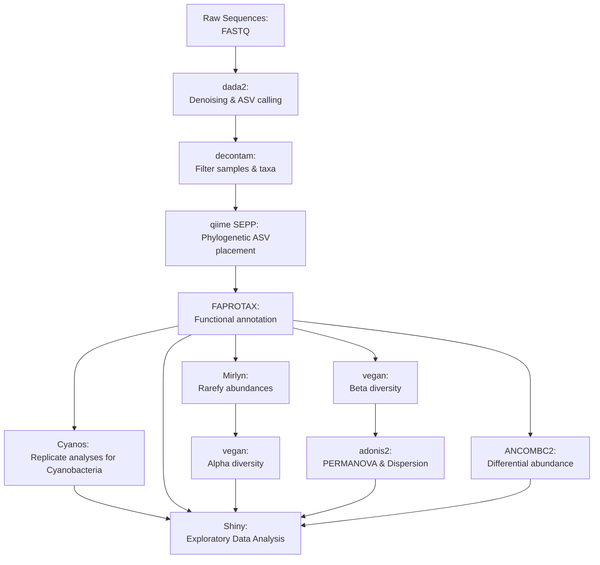

# Desert Ecology Community Assembly

In this project, we ran a battery of analyses on a dataset of 16S amplicon sequencing data from Desert soil undergoing a number of experimental treatments with a full combinatorial experimental design. 

## Pipeline Overview

An overview of the pipeline is constructed here for convenience. Below, specific scripts from `src` corresponding to each step are documented. The output of static final data analyses may be found in `htmls` and `figs`, but shiny Rmd files must be executed locally with accompanying data. 

## Overview of `src` directory

|Pipeline Step| Script Name | Description|
|-----|-----|------|
|Denoising & ASV Calling|`src/deca_16Sdada2.Rmd`|This script performs qc, error correction, abundance quantification and taxonomic classification. The resulting data product is a phyloseq object containing an otu table, taxonomic classifications, sample metadata and reference sequences.|
|Filter samples & taxa|`src/decontam_16S.Rmd`|We then use the decontam package and our negative control to remove any identified ASVs. We also filter out any samples with <2500 Abundance as well as ASVs unique to a sample.|
|Phylogenetic ASV placement|`src/deca_16S_gen_newick.sh`|In order to get a phylogenetic view of the data, we generate a reference tree with our ASVs attached to the tips|
||`src/deca_16S_add_phylogeny.R`|For convenience we attach the tree to our phyloseq object|
||`src/deca_16S_viz_phylo.R`|Here we vizualize some static examples of phylogenetic trees|
|Replicate analyses for Cyanobacteria|`src/deca_subset_cyano.R`|Here we subset the phyloseq object to include only ASVs assigned Phylum Cyanobacteria|
|Functional annotation|`src/deca_16S_faprotax.Rmd`|We annotate identified ASVs with FAPROTAX functional annotations|
||`src/cyano_16S_faprotax.Rmd`|Same as above, but subset for Phylum Cyanobacteriota|
||`src/deca_16S_faprotax_eda.Rmd`|Here we generate **interactive** alluvial plots connecting relative abundance & sample metadata to functional annotations|
||`src/cyano_16S_faprotax_eda.Rmd`|Same as above, but subset for Phylum Cyanobacteriota|
|Rarefy Abundances|`src/deca_16Smirlyn.Rmd`|Here we rarefy ASVs to normalize library size. This makes alpha diversity calculations more reliable. We randomly sample abundance distributions for each sample 50 times and average these to produce an averaged, stable ASV table from which to draw alpha diversities|
||`src/generate_db.R`|Due to memory constraints, it's practically impossible to work with 50 replications of an entire ASV table, so we write the results to a PSQL database|
||`src/start_decadb.sh`|This script starts up the db if it's off. Works inside containers!|
|Alpha Diversity|`src/deca_16S_graph_rare_alpha.Rmd`|Here we take the rarefied ASV table and calculate several alpha diversity metrics|
||`src/deca_16S_graph_func_alpha.Rmd`|Same as above, but for functional alpha diversity|
||`src/cyano_16S_graph_alpha.Rmd`|Same as above, but for Phylum Cyanobacteriota|
|Beta Diversity|`src/deca_16Sordination.Rmd`|Beta diversity is calculated by BC and UniFrac distance matrices|
||`src/deca_16Spermanova.Rmd`|Then we do a PERMANOVA to determine which variables best partition the data|
|Differential Abundance|`src/deca_16Sancombc.Rmd`|We generate several runs of ancombc2 to test for differential abundance using these each of the metadata variables|
||`src/deca_16S_ancombc_eda.Rmd`|We generate an **interactive** panel to explore ANCOMBC2 results|

